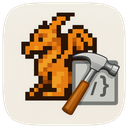

# LOTWEdit

A macOS application for editing [Legacy of the Wizard](https://en.wikipedia.org/wiki/Legacy_of_the_Wizard) NES ROM files. This is a work-in-progress and currently only supports editing the tile data in rooms.

## Features

- Visual room editor with 128-room world map
- Real-time tile editing with paint mode
- Undo/redo support with keyboard shortcuts
- Zoom controls (1x-8x) for detailed editing
- High-performance rendering with image caching
- Save modified ROMs back to disk

## Requirements

- macOS 14.5 or later
- Xcode 15 or later
- Legacy of the Wizard NES ROM file (.nes)

## License

This project is licensed under the MIT License - see the [LICENSE](LICENSE) file for details.

Legacy of the Wizard is a trademark of its respective owners. This editor is an unofficial tool and is not affiliated with or endorsed by the original creators.
